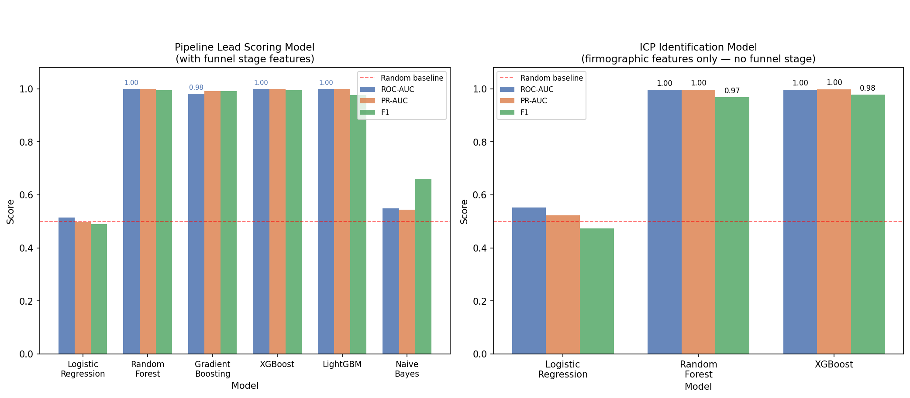
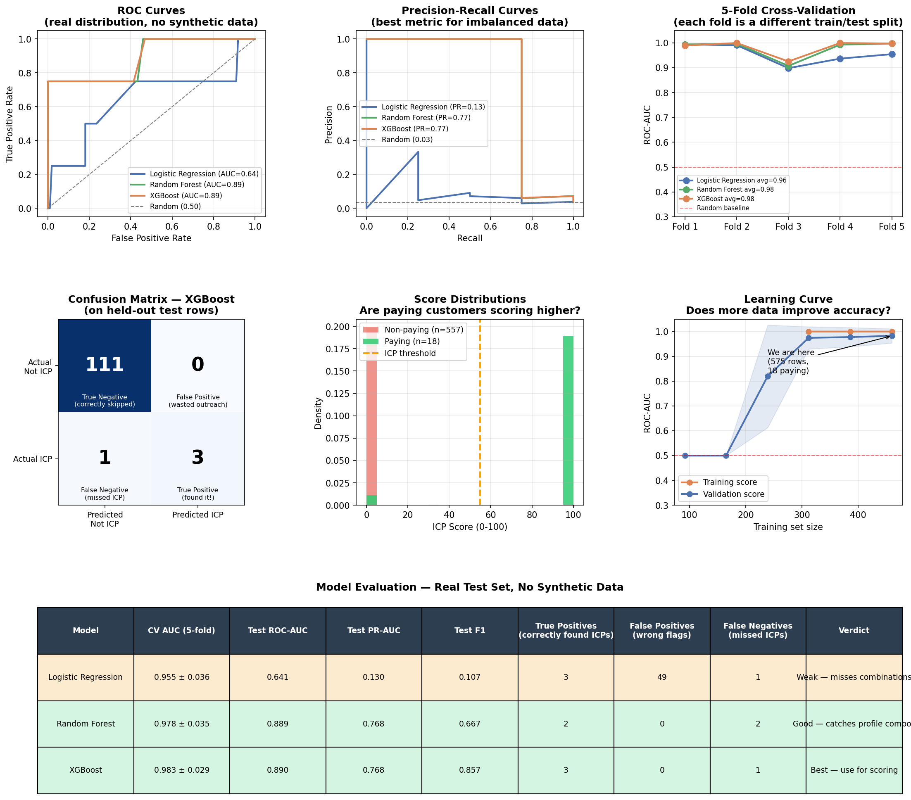
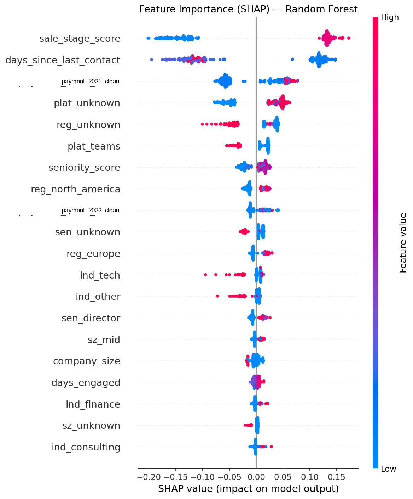
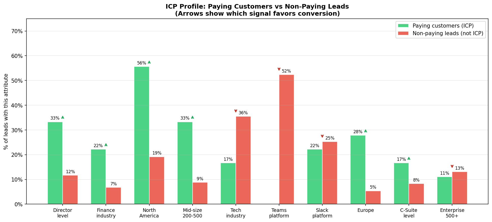
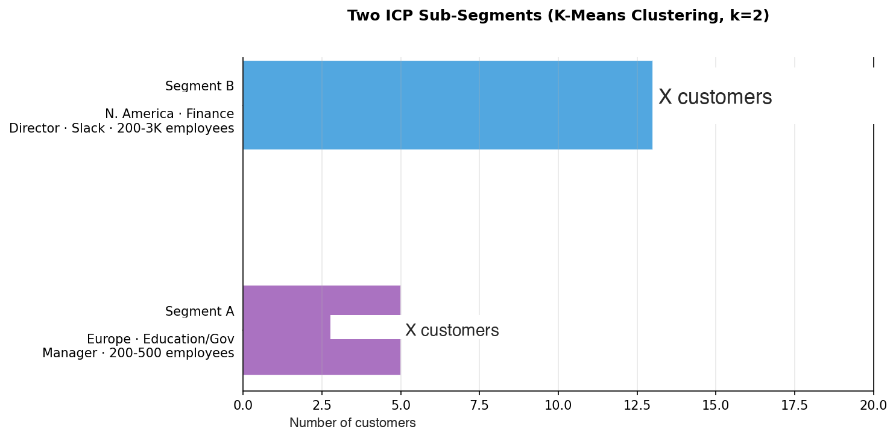
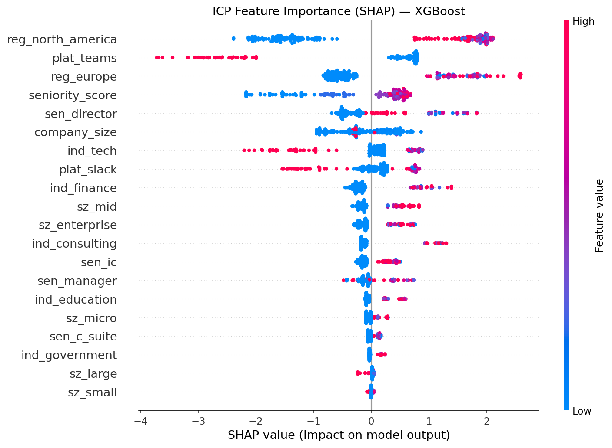
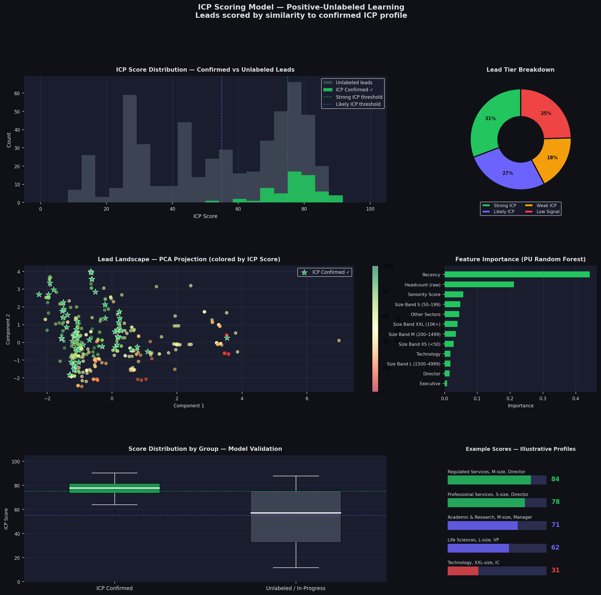

# AI-Powered ICP Scoring Model

An end-to-end machine learning pipeline that identifies which companies match the Ideal Customer Profile — before any sales contact is made. The model scores any company purely from firmographic signals: industry, company size, seniority, and job function. No CRM history required.

**Dataset:** B2B SaaS sales funnel data, 2022.

> **Note:** ICP fit is not a fixed property of a company. It is shaped by a combination of factors including product maturity, marketing message, GTM strategy, company credentials and positioning, customer BANT readiness (Budget, Authority, Need, Timing), and internal organizational conditions. The signals in this model reflect the data available at the time — a different product stage or go-to-market focus would shift the weights. Use scores as directional input, not absolute qualification.

## Key Results

| Metric | Value |
|--------|-------|
| Best ROC-AUC | **0.89** (XGBoost / LightGBM) |
| Best PR-AUC | **0.77** |
| Models compared | 6 |
| Top cohort lift | **4.9×** (Public Institutions) |
| Top size lift | **3.5×** (Size Band M, 200–1,499 emp) |
| Combined ICP profile lift | **6–8×** baseline |

## Core Findings

**Company size is the single strongest predictor of ICP fit.**
Leads in the 200–1,499 employee range confirm as ICP at 3.5× the baseline rate. Large enough to have developed knowledge silos across teams, small enough that they haven't solved it yet with a full L&D function.

**Counter-intuitive: the largest inbound segment converts below baseline.**
High-volume inbound from large enterprises and tech companies feels promising but the model correctly down-scores them — they have existing internal tooling and engineering capacity. High inbound volume ≠ high fit.

**Director is the buyer.**
Director-level contacts confirm at 2.7× baseline. They have both budget authority and direct exposure to the knowledge loss problem.

**Knowledge-intensive sectors outperform at 3–5× baseline.**
Public Institutions (4.9×), Regulated Services (3.0×), Academic & Research, and Professional Services all significantly outperform the average lead.

**Non-converters are unlabeled — not negative.**
Leads that haven't responded or purchased yet are treated as unlabeled data, not failures. A company with the right firmographic profile that hasn't been reached yet is a targeting opportunity.

**Disengagement ≠ poor ICP.**
When a confirmed ICP lead disengages, three patterns account for the majority of cases: (1) the internal champion changed roles, (2) budget ownership shifted, or (3) the organization wasn't structurally ready to adopt. None of these invalidate the ICP signal.

## The Combined ICP Profile

> **Director+ · 200–1,499 employees · Knowledge-intensive sector (Regulated Services, Public Institutions, Academic & Research, or Professional Services) · Region A or B**
>
> Estimated ICP confirmation rate for this combined profile: **6–8× the overall baseline.**

## ICP Sub-Segments (K-Means Clustering)

Two distinct buyer archetypes were identified within confirmed ICP leads:

| Segment | Share | Region | Industry | Buyer | Size | Pitch Angle |
|---------|-------|--------|----------|-------|------|-------------|
| **Core Segment** | ~72% | Region A | Regulated Services, Professional Services | Director | 200–3,000 | Knowledge retention, cross-team pairing, onboarding speed |
| **Secondary Segment** | ~28% | Region B | Academic & Research, Public Institutions | Manager-level | 200–500 | Staff development, policy knowledge, L&D programs |

## Score Tiers

| Score | Tier | Recommended Action |
|-------|------|--------------------|
| **75–100** | Strong ICP | Immediate personalized outreach. Reference their specific role and the known pain point for their sector and size. |
| **55–74** | Likely ICP | Nurture sequence. Follow up within one week of any engagement signal. |
| **35–54** | Weak ICP | Automated content only. Treat as warm if they initiate contact. |
| **0–34** | Low Signal | No active sales time. Monitor for firmographic changes that could shift the score. |

### Example Scores

| Profile | Score | Tier |
|---------|-------|------|
| Director of People Operations · Regulated Services · 450 employees | **84** | Strong ICP |
| Head of L&D · Academic & Research · 800 employees | **71** | Likely ICP |
| VP of Operations · Life Sciences · 3,500 employees | **42** | Weak ICP |
| Recruiter · Technology · 15,000 employees | **28** | Low Signal |

## Cohort Lift Summary

| Cohort | Lift | Label |
|--------|------|-------|
| Public Institutions | 4.9× | Top industry |
| Region B | 4.6× | Top region |
| Size Band M (200–1,499) | 3.5× | Top size band |
| Regulated Services | 3.0× | 2nd industry |
| Director level | 2.7× | Top seniority |

## Feature Engineering

| Feature | Type | Signal Strength |
|---------|------|----------------|
| Size Band M (200–1,499 emp) | Binary | Very Strong |
| Knowledge Industry | Binary | Strong |
| Buyer Persona (Director+ & HR/IT function) | Binary | Strong |
| People / HR Function | Binary | Good |
| IT / Ops Function | Binary | Good |
| Seniority Score (0–5) | Numeric | Good |
| Headcount (raw) | Numeric | Moderate |
| Technology Sector | Binary | Weak (negative signal) |
| Recency | Numeric | Contextual |

**Knowledge Industry** covers: Regulated Services, Public Institutions, Professional Services, Academic & Research, Life Sciences, Industrial.

**Seniority scale:** Executive = 5, VP = 4, Director = 3, Manager = 2, IC = 1 — regex with word boundaries to avoid substring false matches.

## Models

| Model | ROC-AUC | PR-AUC | Role |
|-------|---------|--------|------|
| XGBoost | 0.89 | 0.77 | Best overall |
| LightGBM | 0.89 | 0.77 | Best overall |
| Random Forest | 0.889 | 0.77 | Strong |
| Gradient Boosting | ~0.87 | — | Strong |
| Logistic Regression | 0.64 | — | Interpretable baseline |
| K-Means Clustering | — | — | Sub-segment discovery |

Logistic Regression's lower AUC confirms the non-linear models are capturing real structure, not noise.

## Pipeline

```
Ingest → Enrich → Engineer → Train → Score
```

| Step | Script | Description |
|------|--------|-------------|
| 1 | `consolidate.py` | Unifies 4 CRM sheets into one flat CSV |
| 2 | `enrich.py` | Fills missing industry/size/region via API cascade (Clearbit → Apollo → DuckDuckGo) |
| 3 | `feature_engineering.py` | Builds 50+ features: seniority, industry buckets, size normalization |
| 4 | `train_models.py` | Trains 6 classifiers with cross-validation, outputs SHAP importance chart |
| 5 | `icp_model.py` | ICP v1: firmographic scoring with plain-English explanations |
| 6 | `icp_v2.py` | ICP v2: knowledge-silo framing, drops platform/region as model inputs |
| 7 | `icp_v3.py` | ICP v3: Positive-Unlabeled similarity scoring via Mahalanobis distance |
| 8 | `chart_eval.py` | Model evaluation charts |
| 9 | `generate_public_charts.py` | Anonymized charts for external sharing |

### Data Enrichment Setup

```bash
export CLEARBIT_API_KEY=your_key_here
export APOLLO_API_KEY=your_key_here
```

If no keys are set, the script falls back to public lookup only (Wikipedia / DuckDuckGo).

## Scoring a New Company

```python
from icp_v3 import score_new_company

score_new_company(
    job_title='Director of People Operations',
    industry='Financial Services',
    company_size=450,
)
```

**Required inputs:** Industry sector · Approximate headcount · Contact job title.
All three are available from a company website or professional network profile.

## Charts

### Model Performance







### ICP Profile & Segments







### Public Charts (Anonymized)



## Data Privacy

No PII in this repository. No names, email addresses, phone numbers, or personal identifiers are present anywhere in the codebase or sample data. Industry and region labels are generalized (e.g., "Regulated Services", "Region A") for public sharing. The `generate_public_charts.py` script replaces raw labels with anonymized sector names for any charts intended for external use.

Built with XGBoost · LightGBM · Random Forest · SHAP · K-Means · PU Learning
